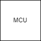

# Hardware Development Board
Alex Seburn and I designed a hardware development board to learn more about hardware and firmware.

## System Block Diagram
The board has lots of ICs, LEDs, external interfaces, and fun things to play around with also providing a great way to learn.

## Dev Board Components
[EEPROM](./EEPROM.md) The EEPROM used for storing and reading random data.