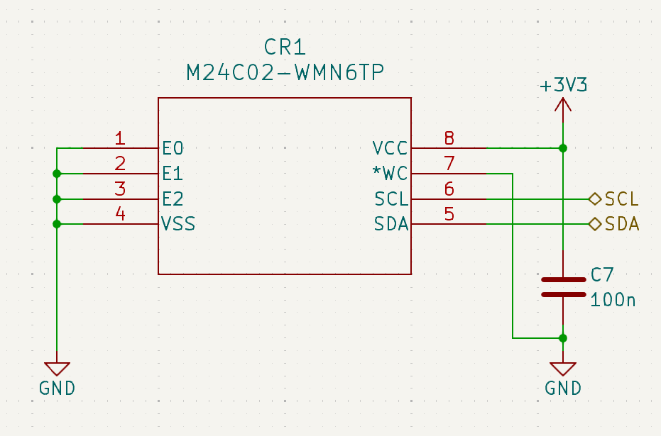
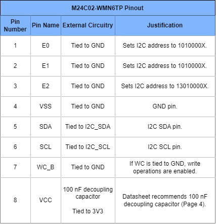
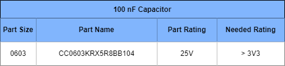

[Overview](./Dev_Board.md)

# EEPROM
The EEPROM used is the **M24C02-WMN6TP**. It has an I2C interface, 2-Kbit of memory, and works on the dev board 3V3 supply rail.

# Schematic

# Component Pinout

# Peripheral Components
## 100 nF Capacitor

