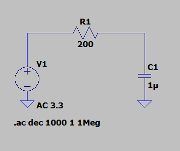

[Overview](./Dev_Board.md)

# Temp Sensor
The temperature sensor used is the **MCP9700T-E/LT**. It has a single analog output that ranges from +20C to +70C with a 10 mV/C resolution.

# Schematic

# Component Pinout

# Peripheral Components
## 1 uF Capacitor

## 200 Ohm Resistor

# Simulation
The lowpass filter used for the temperature sensor has a cutoff frequency of around 800 Hz.

This filter was then simulated.

